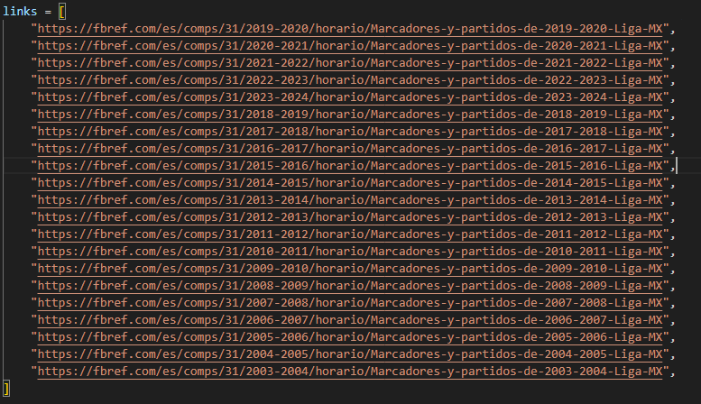
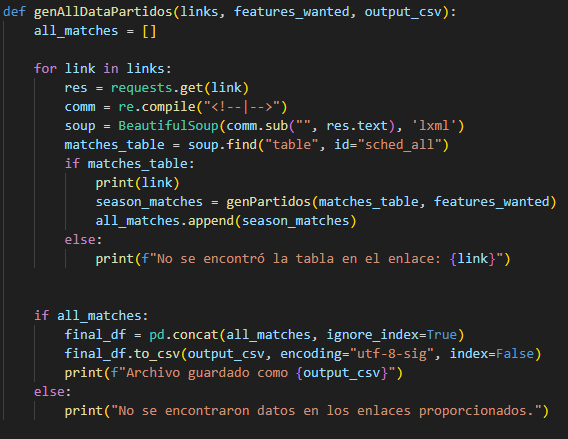
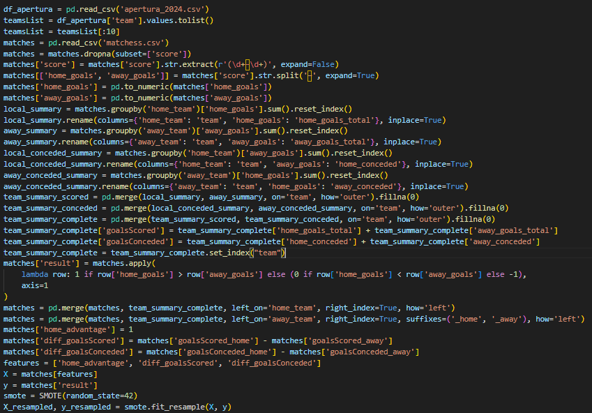
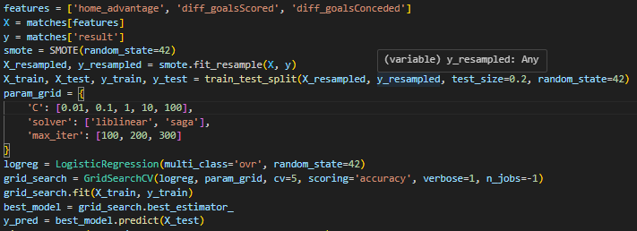
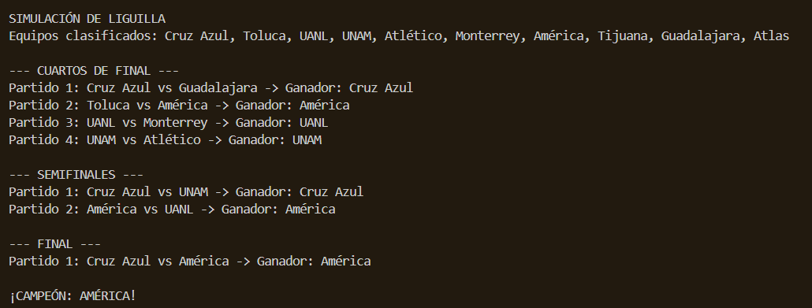
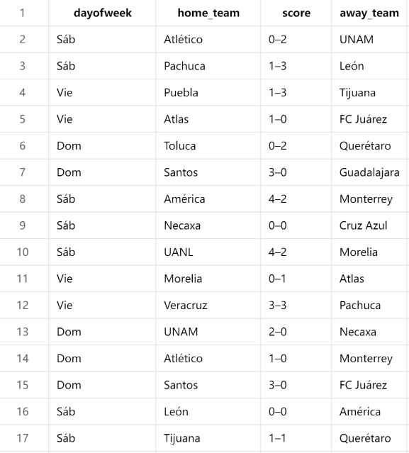

# FBRef-WebScrapper-to-simulate-Liga-MX-Liguilla

This is a project we are using to predict the results of the current and future matches of Liga MX's liguilla. We are achieving this by dividing the overall project in two stages:
    -First part is scrapping the data from FBRef.
    -Second part is building a Logistic Regression model and trainning it with the data retrieved to get the desired predictions. 

Code for scrapping matches information along with code for scrapping liguilla is ours.

Code for regular season table comes from: https://github.com/chmartin/FBref_EPL
I've only modified a thing or two to get it working with the apertura 2024 top 10 teams in order to predict liguilla results.

The options for scrapping in our code also include the following:
    - Clausura tournament.
    - Apertura tournament.
    - Liguilla specific matches.
    - General tournament table.
    - History of results per season. (Home, away, xGoals and other features.)

For player stats and other features you can check this repository: https://github.com/parth1902/Scrape-FBref-data

First you need to set the URL's of the seasons you want to scrape data from, as follows:
```

```

Then you can use the functions to generate the dataframes, you have genTable for league table, league home/away table, regular season Apertura and regular season Clausura. genLiguilla is for Apertura Liguilla and Clausura Liguilla. However, we are using the genAllDataPartidos function, which generates a Dataframe with the history of matches from 2002, using the links provided above. 
```

```

You have to pass some arguments to the function as well: the list of links to get the data from, another list with the features (columns) you want to keep on the DataFrame and the name of the resulting csv file.
```
    genAllDataPartidos(links, partidos_features, "matchess.csv")
```

Our model is based on the overall results one team has had over another one, considering whether a team was home or away, the number of goals conceded and scored as home and the number of goals conceded and scored as away, so first part is preprocessing the data to leave it in just one dataframe with the features we need:

```

```

Then, before feeding the model with our data, we separate the trainning and testing samples and make a Grid Search to find the optimal hiperparameters to make sure we get the best results possible. 
Once this process finishes, we can forward the data to the model for trainning.

```

```

After the trainning, we call the function simularTorneo to simulate the rest of the liguilla based on historical results, this predicts and prints on console the way the liguilla face-offs are going to deliver and also predicts the future champion of the Liga MX.

```

```

Final Dataframe: 


